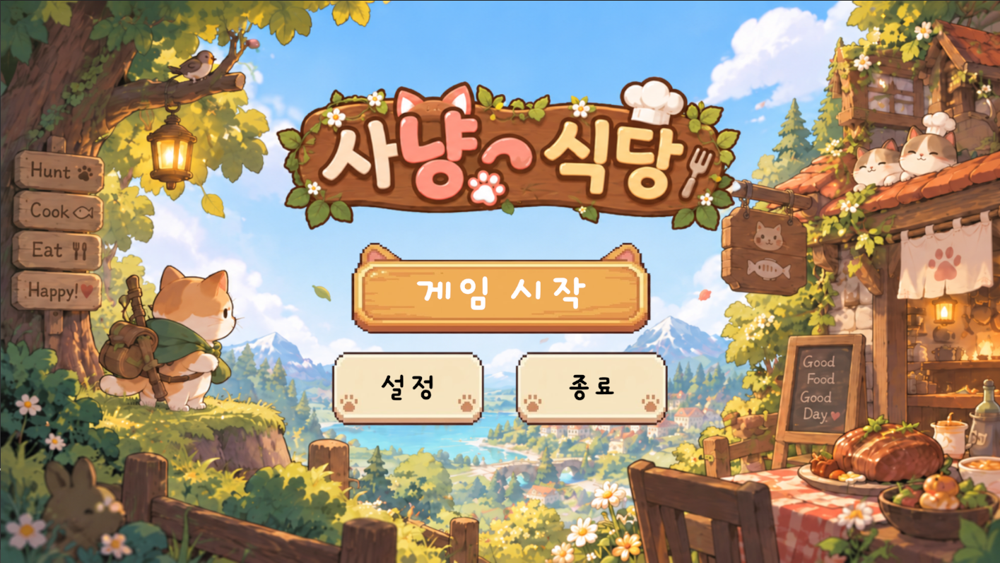
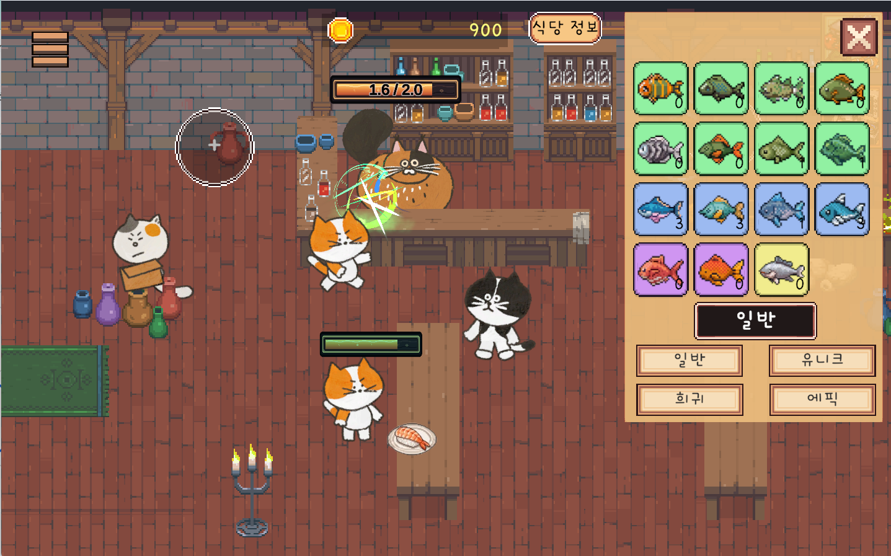
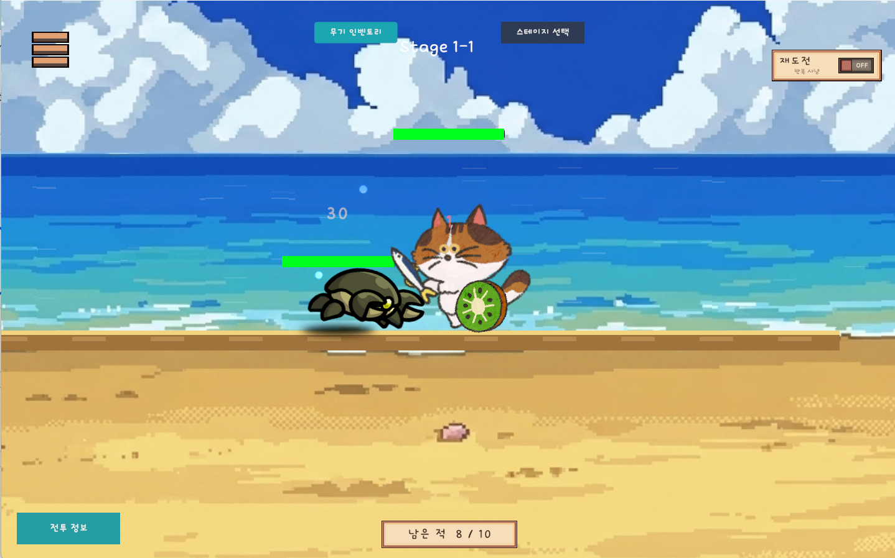
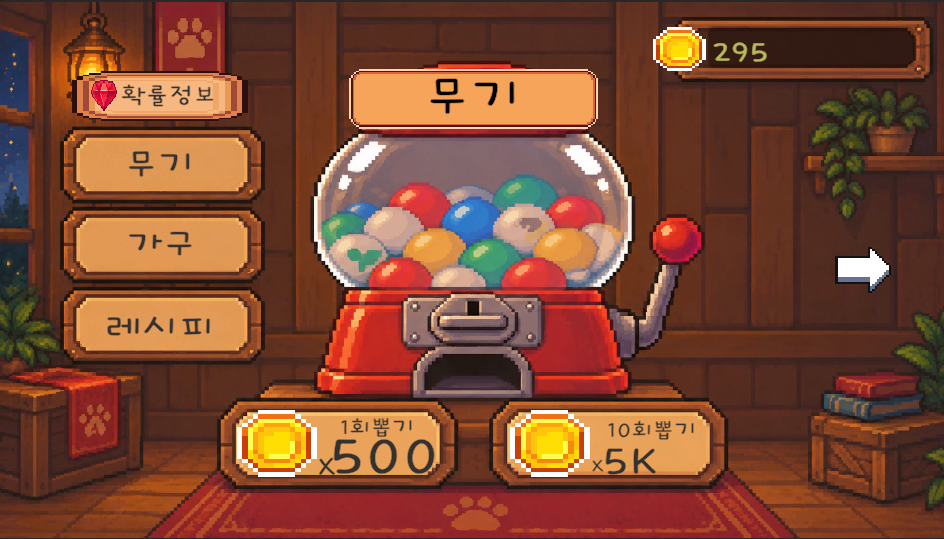
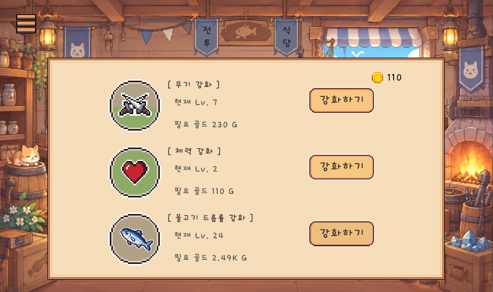

# 사냥식당

**사냥으로 모은 물고기가 식당의 요리가 되고, 식당의 수익이 다음 성장으로 이어지는 Unity 방치형 게임입니다.**



| 항목 | 내용 |
| --- | --- |
| 팀 | 최백김3 |
| 개발기간 | 2026.08.31 ~ 2026.09.29 |
| 교육기관 | 넥스트러너스 오즈코딩스쿨 |
| 멘토 | 정경수 |
| 장르 | 자동 전투와 식당 경영을 결합한 방치형 게임 |
| 실행 대상 | Windows PC |
| 개발환경 | Unity 6.3 LTS (`6000.3.17f1`), C# |

## 목차

- [게임 소개](#게임-소개)
- [주요 기능과 화면](#주요-기능과-화면)
- [기술 스택](#기술-스택)
- [프로젝트 실행](#프로젝트-실행)
- [조작 방법](#조작-방법)
- [시스템 설계](#시스템-설계)
- [폴더 구조](#폴더-구조)
- [저장 데이터](#저장-데이터)
- [팀 구성](#팀-구성)
- [개발 과정과 개선 사항](#개발-과정과-개선-사항)
- [플레이 점검 항목](#플레이-점검-항목)

## 게임 소개

사냥식당은 자동 전투, 식당 경영, 수집과 강화를 하나의 성장 흐름으로 연결한 프로젝트입니다. 전투에서는 물고기를 얻고, 식당에서는 물고기를 요리에 사용해 골드를 획득합니다. 골드로 능력과 시설을 강화하거나 가챠를 이용해 다음 전투와 식당 운영을 준비합니다.

```text
자동 전투 → 물고기 획득 → 식당 요리·판매 → 골드 획득
    ↑                                      ↓
    └──── 전투·생산 능력 성장 ← 강화·가챠 ────┘
```

무기는 전투에, 가구는 식당 배치에, 레시피는 요리 해금과 가격에 연결됩니다. 다섯 개의 씬을 기능별로 분리하고 공통 재화와 저장 데이터를 통해 연동했습니다.

## 주요 기능과 화면

아래 이미지는 프로젝트 발표 자료에 포함된 구동 화면입니다.

### 타이틀과 공통 UI

- 시작·설정·종료 UI와 씬 이동 메뉴
- 비동기 씬 로딩, 진행률 표시, 페이드 전환
- DOTween 기반 캐릭터·텍스트 연출과 랜덤 로딩 팁
- 프레임 제한, 볼륨, 해상도·전체화면 설정
- 진행 데이터 저장·불러오기와 방치 보상

### 식당 경영 — Business Scene



- 손님 생성, 좌석 배정, 주문·식사·퇴장 흐름
- 주문 큐와 셰프별 코루틴을 통한 요리 생산
- 물고기 재료 소비와 판매 골드 획득
- 식당·셰프·가구 성장 효과 반영
- 레시피 보유에 따른 음식 가격 보너스

### 자동 전투 — Combat Scene



- 스테이지 진행, 재도전 및 무한 모드
- FSM 기반 플레이어·적 행동과 자동 전투
- 무기 장착과 스킬, 적 처치 시 물고기 드롭
- 취소 토큰과 공격 구간 ID를 활용한 타격 유효성 검사
- 플레이어 접근에 따른 적 생성·활성화

### 수집 — Gacha Scene



- 무기·가구·레시피 뽑기
- 등급별 가중치 추첨과 천장(피티) 시스템
- 결과 카드 공개 연출과 인벤토리
- 무기 합성과 수집 결과의 전투·식당 연동

### 성장 — Upgrade Scene



- 무기·체력·드롭률·식당·셰프 강화
- 현재 레벨과 강화 비용 표시
- 길게 누르는 연속 강화와 골드 부족 시 자동 중단
- `BigNumber`를 활용한 큰 수와 K·M·B 단위 표시
- 강화 구매 후 효과 반영과 저장

## 기술 스택

| 기술 | 사용 목적 |
| --- | --- |
| Unity `6000.3.17f1` / C# | 씬, 게임 로직, UI 및 데이터 연결 |
| Universal Render Pipeline `17.3.0` | 렌더링 파이프라인 |
| Input System `1.19.0` | 키보드 입력 처리 |
| UniTask | 비동기 공격 루프, 스테이지 전환, 취소 토큰 처리 |
| DOTween | UI와 로딩 화면 애니메이션 |
| ScriptableObject | 스테이지·드롭·무기·가챠·강화 데이터 관리 |
| JsonUtility / JSON | 플레이어 진행 데이터 직렬화와 로컬 저장 |
| PlayerPrefs | 프레임 제한 등 사용자 설정 저장 |
| 이벤트 / 오브젝트 풀링 | 변경 시 UI 갱신, 반복 사용 객체 재활용 |

정확한 에디터 버전은 [ProjectVersion.txt](ProjectSettings/ProjectVersion.txt), 패키지 구성은 [manifest.json](Packages/manifest.json)과 [packages-lock.json](Packages/packages-lock.json)을 기준으로 합니다. UniTask는 Git 패키지이며, DOTween은 `Assets/Plugins/Demigiant`에 포함되어 있습니다.

## 프로젝트 실행

### 1. 준비

- Unity Hub와 **Unity Editor `6000.3.17f1`**을 설치합니다.
- Windows 실행 파일을 빌드하려면 해당 에디터의 Windows 빌드 지원 모듈을 설치합니다.
- UniTask Git 패키지를 가져올 수 있도록 Git을 설치하고 패키지 다운로드가 가능한 네트워크를 준비합니다.

### 2. 저장소 열기

```bash
git clone https://github.com/jigwang99/OzCodingSchool_TeamProject.git
```

Unity Hub에서 **Add / 디스크에서 프로젝트 추가**로 저장소의 루트 폴더를 선택합니다. 지정된 에디터로 열고 패키지 복원과 에셋 임포트가 끝날 때까지 기다립니다.

### 3. 외부 에셋 준비

일부 외부 에셋은 저작권·용량 문제로 Git에서 제외되어 있습니다. **저장소 복제만으로 원본과 동일한 화면이나 정상 컴파일을 보장할 수 없습니다.** 프로젝트에서 사용하는 에셋을 팀의 공유 절차와 각 에셋의 이용 조건에 따라 준비해야 합니다.

현재 [.gitignore](.gitignore)에 명시된 주요 제외 경로는 다음과 같습니다.

```text
Assets/Business Assets/
Assets/Business_Assets/
Assets/SPUM/
Assets/SP1/
Assets/Eric VFX Studio/
Assets/HitEffectPack/
Assets/WCE Assets/
Assets/98.Fonts/Cafe24DongdongRegular Bitmap.asset
```

프리팹과 씬 참조가 유지되도록 팀에서 사용한 에셋 및 `.meta` 파일을 함께 준비합니다. 누락된 타입이나 `Missing Script`, 이미지·폰트 참조 오류가 발생하면 먼저 외부 에셋 구성을 확인합니다. 외부 에셋의 이용·재배포 조건은 각 원저작자의 라이선스를 따릅니다.

### 4. 에디터에서 실행

1. `Assets/00.Scenes/TitleScene.unity`를 엽니다.
2. Console의 컴파일 오류와 누락된 참조를 확인합니다.
3. **Play**를 누릅니다.
4. 타이틀의 **게임 시작**을 선택합니다. 현재 시작 대상은 `BusinessScene`입니다.
5. 게임 내 메뉴에서 전투·식당·가챠·강화 화면으로 이동합니다.

DOTween 설정이 필요한 경우 `Tools > Demigiant > DOTween Utility Panel`의 `Setup DOTween...`을 사용합니다.

### 5. Windows 빌드

`File > Build Profiles`에서 Windows 프로필을 선택하고 아래 씬이 활성화되어 있는지 확인한 뒤 빌드합니다. 타이틀을 첫 번째 씬으로 유지합니다.

| 빌드 인덱스 | 씬 | 역할 |
| --- | --- | --- |
| 0 | `TitleScene` | 시작, 설정, 종료 |
| 1 | `CombatScene` | 자동 전투와 스테이지 |
| 2 | `BusinessScene` | 식당 경영 |
| 3 | `GachaScene` | 뽑기와 수집 |
| 4 | `UpgradeScene` | 능력·시설 강화 |

씬 경로와 순서는 [EditorBuildSettings.asset](ProjectSettings/EditorBuildSettings.asset)에 등록되어 있습니다. 빌드 출력은 Git에서 제외된 `Builds/` 등의 폴더를 사용합니다.

## 조작 방법

| 입력 | 동작 |
| --- | --- |
| 마우스 클릭 | 메뉴, 뽑기, 장비, 강화 등 UI 조작 |
| 강화 버튼 길게 누르기 | 연속 강화, 버튼에서 손을 떼면 중단 |
| `Tab` | 게임 씬에서 화면 이동 메뉴 열기·닫기 |
| `Esc` | 설정 팝업 조작, 종료 확인 팝업이 열려 있으면 취소 |

전투와 식당의 기본 진행은 자동이며, 사용자는 장비·강화·수집과 화면 이동을 중심으로 조작합니다.

## 시스템 설계

### 공통 데이터와 매니저

| 구성 요소 | 책임 |
| --- | --- |
| `GameManager` | 전역 초기화, 플레이어 데이터 보관, 프레임 설정 적용 |
| `PlayerData` | 재화·강화·스테이지·수집·방치 보상 등 진행 데이터 |
| `CurrencyManager` | 골드·물고기 획득 및 소비, 재화 변경 이벤트 |
| `SaveManager` | JSON 저장·불러오기와 자동 저장 |
| `IdleFishManager` | 전투 외 시간·미접속 시간의 물고기 보상 정산과 수령 |

전역 데이터는 씬 전환 후에도 유지하며, 기능 간 연결에는 공통 매니저 API와 이벤트, 아이템 ID를 사용합니다.

### 기능별 구성

| 영역 | 주요 클래스와 구조 |
| --- | --- |
| 타이틀·UI | `TitleSceneManager`, `LoadingScreen`, `UIManager`, `UISettingsPopup`, `HamburgerMenuUI` |
| 식당 | `CustomerSpawn`, `Customer`, `ProductionManager`, `MakeFood`, `FacilityManager` |
| 전투 | `BaseUnitController`, `StateMachine`, `StageManager`, `CombatManager`, `EnemySpawner` |
| 전투 모듈 | `UnitHealth`, `UnitMove`, `UnitAttack`, `IUnitView`로 기능과 표현 분리 |
| 가챠 | `GachaManager`, `GachaPitySystem`, `GachaInventory`, `GachaRevealCard` |
| 강화 | `UpgradeManager`, `UpgradeData`, `UpgradeUI`, `BigNumber` |

### 반복 처리와 예외 대응

- **오브젝트 풀링:** 손님·음식·전투 객체·결과 카드·데미지 숫자·체력바 재사용
- **이벤트 기반 UI:** 재화나 강화 상태가 바뀔 때 표시 갱신
- **공용 캔버스:** 데미지 표시와 좌표 변환을 활용한 UI 배치
- **캐시와 버퍼:** 위치·참조 재사용, 숫자 출력용 문자 버퍼 사용
- **타격 검증:** 취소 토큰과 `AttackWindow` ID를 확인해 취소·중복 타격 차단
- **수명 관리:** 비활성화 시 트윈 정리, 이벤트 구독 해제, 종료 중 싱글톤 재생성 방지

위 내용은 적용한 구현 방식입니다. 동일 조건에서 측정한 FPS·GC 할당량 등의 전후 수치는 아직 이 문서에 포함하지 않았습니다.

## 폴더 구조

```text
Assets/
├── 00.Scenes/               # 게임 씬 5개
├── 01.Scripts/
│   ├── Core/                # GameManager, Singleton, BigNumber, SoundManager
│   ├── Data/                # PlayerData
│   ├── Save/                # SaveManager
│   ├── Managers/            # 재화, 전투, 스테이지, 전투 풀 관리
│   ├── Combat/              # FSM, 유닛, 무기, 드롭, 스테이지, 피드백
│   ├── Business Scripts/    # 손님, 좌석, 요리, 식당 시설
│   ├── Gacha/               # 데이터, 추첨, 인벤토리, UI, 어댑터
│   ├── Upgrade/             # 강화 데이터·로직·UI
│   └── UI/                  # 타이틀, 설정, 로딩, 씬 이동, 공통 UI
├── 02.Prefabs/              # 재사용 프리팹
├── 97.Sounds/               # 사운드
├── 98.Fonts/                # 폰트
├── 99.Backgrounds/          # 배경
├── Resources/Combat/        # 런타임에서 로드하는 전투 데이터
├── Plugins/                 # DOTween 등 플러그인
└── Settings/                # 렌더링 등 설정
Docs/
├── images/                  # README용 게임 화면
└── MVP_작업_가이드.md        # 초기 MVP 계획과 통합 기준
Packages/                    # 패키지 명세와 잠금 파일
ProjectSettings/             # Unity 프로젝트 설정
```

[MVP 작업 가이드](Docs/MVP_작업_가이드.md)는 초기 개발 계획입니다. 현재 구현과 다른 클래스명·API·범위가 있을 수 있으므로 실제 코드를 함께 확인합니다.

## 저장 데이터

- 진행 데이터는 `Application.persistentDataPath/playData.json`에 저장됩니다.
- `SaveManager`는 120초 간격으로 자동 저장하며, 강화 구매·방치 보상 수령 등의 흐름에서도 저장을 호출합니다.
- 프레임 제한 등 환경 설정은 `PlayerPrefs`를 사용합니다.
- 방치 보상은 최대 8시간을 기준으로 정산하며, 전투 씬의 보상 UI에서 수령합니다.
- 설정의 저장 데이터 삭제 기능은 진행 파일을 삭제하고 새 플레이어 데이터를 만든 뒤 타이틀로 돌아갑니다.

현재 프로젝트의 Company Name과 Product Name 설정에서 Windows 기본 저장 위치는 다음과 같습니다. 두 설정을 바꾸면 경로도 달라집니다.

```text
%USERPROFILE%\AppData\LocalLow\DefaultCompany\OZ_TeamProject\playData.json
```

진행 초기화가 필요할 때는 설정 UI를 사용합니다. 기존 진행을 보관하려면 먼저 저장 파일을 백업합니다.

## 팀 구성

| 이름 | 담당 | 주요 작업 |
| --- | --- | --- |
| 최지광 | 전투 | 유닛 FSM, 스테이지, 적 스폰, 물고기 드롭, 무기 |
| 백재현 | 식당 | 손님 상태 흐름, 요리 큐 |
| 김동주 | 가챠 | 가챠 매니저, 성장 및 게임 시스템 연결 |
| 김경미 | 업그레이드·데이터 | 강화 로직·UI, 재화 시스템, 저장·불러오기 |
| 김원섭 | UI·QA | 전역 UI, 모달 팝업, 비동기 씬 전환, 사운드, 트윈·예외 처리 |
| 정경수 | 멘토 | 프로젝트 개발 피드백, 유니티 개발 팁, 캔버스 구성·UI 연출 피드백 |

## 개발 과정과 개선 사항

| 기간 | 단계 | 내용 |
| --- | --- | --- |
| 08.31 ~ 09.01 | 사전 기획 | 콘셉트, 핵심 게임 흐름, 역할 분담 |
| 09.01 ~ 09.02 | 구조 설계 | 씬 구성, 공통 매니저, 재화·저장 데이터 연결 |
| 09.03 ~ 09.23 | 기능 구현 | 전투, 식당, 가챠, 강화, 타이틀·UI |
| 09.23 ~ 09.28 | 통합 및 개선 | 기능 연결, 풀링, 이벤트 갱신, 예외 처리 |
| 09.29 | 결과 정리·발표 | 결과보고서와 시연 자료 정리 |

| 점검 대상 | 반영한 대응 |
| --- | --- |
| 씬 전환 시 깜빡임 | 최소 로딩 시간 1.5초 확보 |
| 트윈 수명 관리 | 비활성화 시 Tween Kill |
| 종료 중 싱글톤 재생성 | 종료 상태 확인, 실제 구독 인스턴스의 이벤트 해제 |
| 중복되거나 취소된 공격 | 취소 토큰과 공격 구간 ID 검사 |
| 재화 부족 상태의 연속 강화 | 골드 부족 시 강화 중단 |

향후에는 같은 조건에서 성능 수치를 비교하고, 장기 플레이의 재화 균형과 저장 안정성을 점검하며 QA 재현·수정 기록을 보완할 계획입니다.

## 플레이 점검 항목

다음은 실행 환경 준비 후 확인할 수동 점검 항목입니다. 완료된 자동 테스트 결과를 의미하지 않습니다.

- [ ] 타이틀에서 시작하면 로딩 후 식당 화면에 진입한다.
- [ ] 메뉴로 각 씬을 이동해도 재화와 진행 데이터가 유지된다.
- [ ] 전투에서 적을 처치하면 물고기가 증가한다.
- [ ] 식당에서 재료가 소비되고 요리 판매 후 골드가 증가한다.
- [ ] 가챠 결과가 인벤토리와 관련 기능에 반영된다.
- [ ] 강화 시 골드와 레벨이 갱신되고, 골드가 부족하면 연속 강화가 중단된다.
- [ ] 저장 후 재실행하면 재화·강화·스테이지 진행이 복원된다.
- [ ] 미접속 후 방치 보상을 확인하고 수령할 수 있다.
- [ ] 반복 씬 전환과 종료 과정에서 오류 또는 남은 트윈이 발생하지 않는다.

